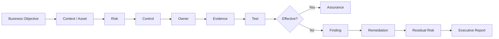

# 🧠 Visual Architecture — Day 08

```mermaid
flowchart LR
A[Business Objective] --> B[Context / Asset]
B --> C[Risk]
C --> D[Control]
D --> E[Owner]
E --> F[Evidence]
F --> G[Test]
G --> H{Effective?}
H -->|Yes| I[Assurance]
H -->|No| J[Finding]
J --> K[Remediation]
K --> L[Residual Risk]
L --> M[Executive Report]
```

### Day focus
**Control Testing & Evidence**
