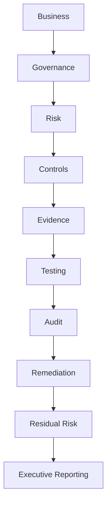

# 🎨 Visual Mode

GitHub renders Mermaid diagrams in Markdown.

```mermaid
flowchart TD
A[Business] --> B[Governance]
B --> C[Risk]
C --> D[Controls]
D --> E[Evidence]
E --> F[Testing]
F --> G[Audit]
G --> H[Remediation]
H --> I[Residual Risk]
I --> J[Executive Reporting]
```

Use the SVGs in `assets/` for the repository landing page.
